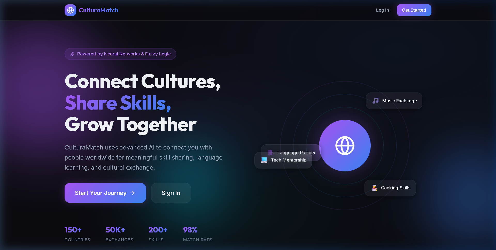
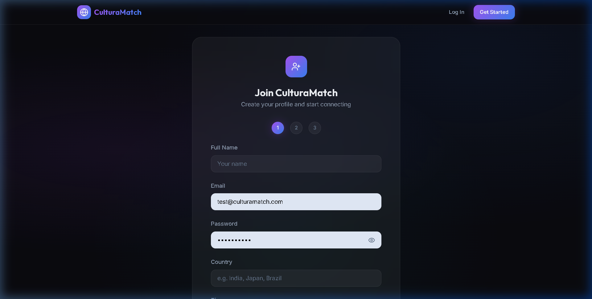
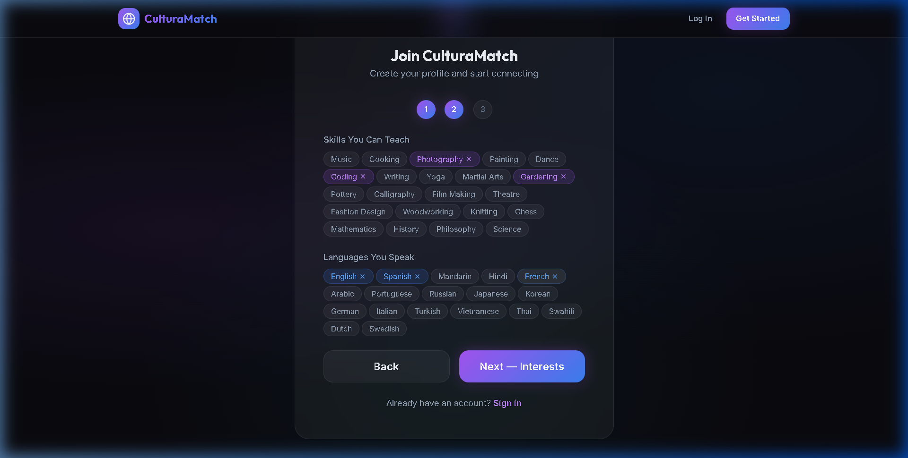
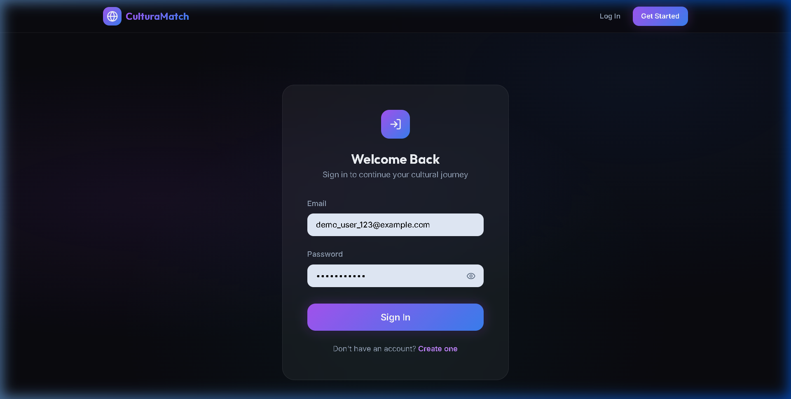
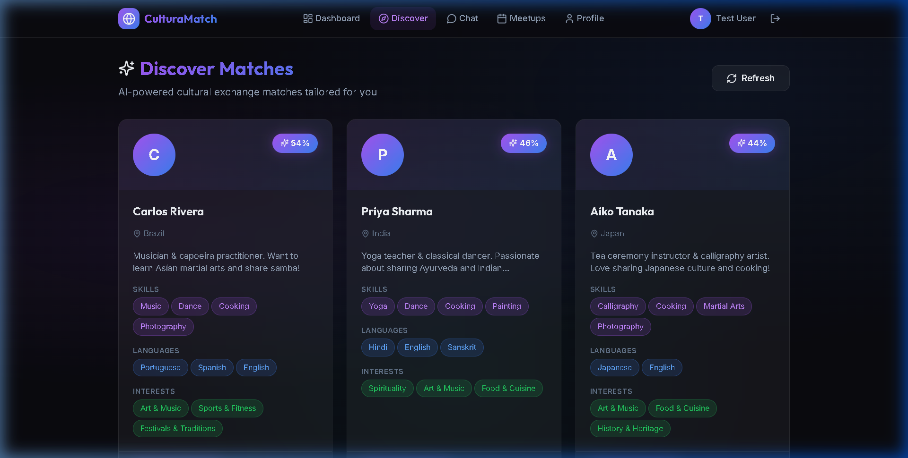
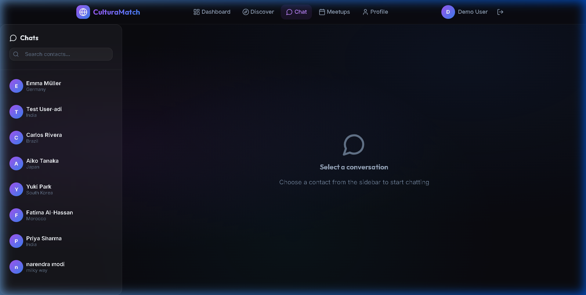
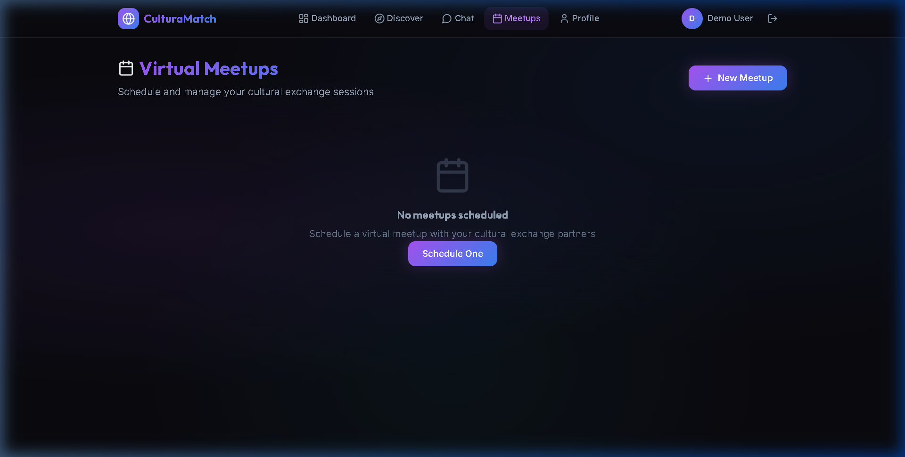

<](LICENSE)
[](https://react.dev/)
[](https://nodejs.org/)
[](https://python.org/)
[](https://vitejs.dev/)

A full-stack cultural exchange platform connecting people worldwide for **skill sharing**, **language learning**, and **cultural interaction** — powered by **AI matching** using Neural Networks & Fuzzy Logic.

<br>



</div>

---

## 📑 Table of Contents

- [✨ Features](#-features)
- [📸 Interface Screenshots](#-interface-screenshots)
- [🏗️ Architecture](#️-architecture)
- [🧠 AI Matching Pipeline](#-ai-matching-pipeline)
- [🛠️ Tech Stack](#️-tech-stack)
- [🚀 Quick Start](#-quick-start)
- [👥 Demo Users](#-demo-users)
- [📁 Project Structure](#-project-structure)
- [📄 License](#-license)

---

## ✨ Features

| Feature | Description |
|---------|-------------|
| 🤖 **AI-Powered Matching** | Fuzzy logic + neural network for intelligent cultural exchange partner matching |
| 🎨 **Skill Sharing** | Share and learn skills like music, cooking, coding, photography, and more |
| 🗣️ **Language Exchange** | Find native speakers and practice languages together |
| 💬 **Real-time Chat** | Instant messaging with your matched cultural exchange partners |
| 📅 **Virtual Meetups** | Schedule and manage cultural exchange sessions |
| ⭐ **Feedback System** | Rate interactions to improve AI recommendations |
| 🌙 **Dark Glassmorphism UI** | Modern, premium design with smooth animations and gradients |
| 🔐 **JWT Authentication** | Secure user registration and login with encrypted passwords |

---

## 📸 Interface Screenshots

### 🏠 Landing Page
> The hero section features an animated globe, floating skill tags, platform statistics, and a stunning dark glassmorphism design with gradient accents.

<div align="center">

</div>

---

### 📝 Multi-Step Registration Flow
> A guided 3-step registration process: **Personal Details → Skills & Languages → Interests & Bio**

<div align="center">
<table>
  <tr>
    <td align="center"><strong>Step 1 — Personal Details</strong></td>
    <td align="center"><strong>Step 2 — Skills & Languages</strong></td>
  </tr>
  <tr>
    <td></td>
    <td></td>
  </tr>
</table>
</div>

---

### 🔑 Login Page
> Clean, centered sign-in form with glassmorphism card, gradient CTA button, and seamless navigation.

<div align="center">

</div>

---

### 📊 Dashboard
> Personalized overview showing match count, conversations, meetups, feedback stats, recent AI matches with compatibility scores, and user profile snapshot.

<div align="center">

</div>

---

### 🔍 AI-Powered Discover Page
> Browse AI-matched cultural exchange partners with compatibility percentages, skills, languages, interests, bios, and country indicators.

<div align="center">

</div>

---

### 💬 Chat Interface
> Contact sidebar with search, user avatars with country indicators, and a conversation panel for real-time cultural exchange messaging.

<div align="center">

</div>

---

### 👤 User Profile
> Detailed profile view displaying user avatar, bio, skills, languages spoken, and cultural interests — all with gradient-styled tag chips.

<div align="center">

</div>

---

### 📅 Virtual Meetups
> Schedule and manage cultural exchange sessions with partners. Create new meetups, set topics, and coordinate across time zones.

<div align="center">

</div>

---

## 🏗️ Architecture

```
┌──────────────────┐     ┌─────────────────┐     ┌──────────────────────┐
│   React + Vite   │────▶│  Node.js/Express│────▶│  Python Flask AI     │
│   Frontend       │ API │  Backend        │ API │  Matching Service    │
│   (port 5173)    │     │  (port 5000)    │     │  (port 5001)         │
└──────────────────┘     └─────────────────┘     └──────────────────────┘
                              │                       │
                              ▼                       ▼
                         JSON File Storage       Neural Network +
                         (users, chats, etc.)    Fuzzy Logic Engine
```

The platform follows a **three-tier microservice architecture**:

1. **Frontend** — React + Vite SPA with client-side routing, dark glassmorphism theme, and responsive design
2. **Backend** — RESTful API handling authentication (JWT + bcrypt), user management, chat, and meetup operations
3. **AI Service** — Python Flask microservice implementing the fuzzy logic + neural network matching engine

---

## 🧠 AI Matching Pipeline

```
┌─────────────────┐     ┌──────────────────┐     ┌─────────────────┐
│  User Profiles  │────▶│  Fuzzy Logic     │────▶│  Combined Score │
│  (skills, langs,│     │  Engine (60%)    │     │  (weighted avg) │
│   interests)    │     └──────────────────┘     └────────┬────────┘
│                 │     ┌──────────────────┐              │
│                 │────▶│  Neural Network  │──────────────┘
│                 │     │  (40%)           │     ▼
└─────────────────┘     └──────────────────┘   Ranked Matches
```

| Stage | Method | Details |
|-------|--------|---------|
| **1. Fuzzy Logic** | Triangular & trapezoidal membership functions | Scores compatibility across skill overlap, language similarity, cultural interest alignment, and timezone proximity |
| **2. Neural Network** | Feedforward (4→8→1) | Trained on user feedback to personalize match quality predictions |
| **3. Combined Score** | Weighted blend | **60% fuzzy** + **40% neural** prediction for final match ranking |

---

## 🛠️ Tech Stack

| Layer | Technology | Purpose |
|-------|-----------|---------|
| **Frontend** | React 18, Vite, React Router, Lucide Icons | Modern SPA with dark glassmorphism UI |
| **Backend** | Node.js, Express, JWT, bcrypt | RESTful API with secure authentication |
| **AI Service** | Python Flask, NumPy, Fuzzy Logic | Intelligent matching engine |
| **Storage** | JSON files (zero-config) | Lightweight file-based persistence |
| **Typography** | Inter + Outfit (Google Fonts) | Premium modern typography |
| **Design** | Dark glassmorphism, CSS animations | Stunning visual experience |

---

## 🚀 Quick Start

### Prerequisites

- **Node.js 18+** — [Download](https://nodejs.org/)
- **Python 3.9+** *(optional, for AI service)* — [Download](https://python.org/)

### Installation & Setup

```bash
# 1. Clone the repository
git clone https://github.com/adi4sure/CulturaMatch.git
cd CulturaMatch

# 2. Install frontend dependencies
cd frontend && npm install

# 3. Install backend dependencies
cd ../backend && npm install
```

### Running the Application

Open **3 separate terminals** and run:

```bash
# Terminal 1 — Backend API (port 5000)
cd backend && npm run dev

# Terminal 2 — Frontend UI (port 5173)
cd frontend && npm run dev

# Terminal 3 — AI Service (port 5001) [Optional]
cd ai-service
pip install -r requirements.txt
python app.py
```

Open **http://localhost:5173** in your browser 🎉

---

## 👥 Demo Users

The app comes pre-seeded with **6 demo users** from around the world:

| Name | Country | Skills | Languages |
|------|---------|--------|-----------|
| 🇯🇵 Aiko Tanaka | Japan | Calligraphy, Cooking, Martial Arts | Japanese, English |
| 🇧🇷 Carlos Rivera | Brazil | Music, Dance, Cooking, Photography | Portuguese, Spanish, English |
| 🇮🇳 Priya Sharma | India | Yoga, Dance, Cooking, Painting | Hindi, English, Sanskrit |
| 🇩🇪 Emma Müller | Germany | Music, Writing, Philosophy | German, English, French |
| 🇲🇦 Fatima Al-Hassan | Morocco | Cooking, Pottery, Calligraphy | Arabic, French, English |
| 🇰🇷 Yuki Park | South Korea | Film Making, Music, Coding | Korean, English, Japanese |

> **Tip:** Register a new account to see the AI matching in action! The system will analyze your skills, languages, and interests to find the best cultural exchange partners.

---

## 📁 Project Structure

```
CulturaMatch/
├── frontend/               # React + Vite frontend
│   ├── src/
│   │   ├── pages/          # Page components
│   │   │   ├── LandingPage.jsx     # Hero section + features
│   │   │   ├── LoginPage.jsx       # Sign in form
│   │   │   ├── RegisterPage.jsx    # 3-step registration
│   │   │   ├── Dashboard.jsx       # User dashboard
│   │   │   ├── DiscoverPage.jsx    # AI match discovery
│   │   │   ├── ChatPage.jsx        # Messaging interface
│   │   │   ├── ProfilePage.jsx     # User profile management
│   │   │   └── MeetupPage.jsx      # Virtual meetup scheduling
│   │   ├── App.jsx                 # Routing + auth context
│   │   └── index.css               # Design system (400+ lines)
│   └── index.html
├── backend/                # Node.js + Express backend
│   ├── server.js           # Full REST API
│   ├── data/               # JSON file storage
│   └── package.json
├── ai-service/             # Python Flask AI service
│   ├── app.py              # Fuzzy logic + neural network
│   └── requirements.txt
├── screenshots/            # Interface screenshots
├── setup.bat               # Windows setup script
└── README.md
```

---

## 📄 License

This project is licensed under the **MIT License** — see the [LICENSE](LICENSE) file for details.

---

<div align="center">

**Built with ❤️ for cultural exchange and global connection**

[⬆️ Back to Top](#-culturamatch)

</div>
]]>
